# [Direktorenhaus](https://www.direktorenhaus.com) (current internship) in Berlin, Germany

- Videographer,
- Animator,
- Social media manager,
- Photographer

During my internship, I am helping the company produce better photos and videos for social media and other platforms:

   
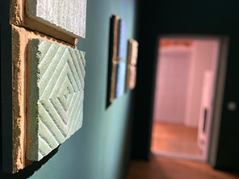  
 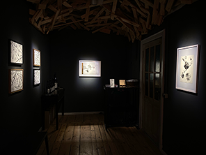 

### Interview scene
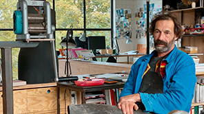

# [Animation/Film instructor for kid's camp](https://www.lks.sk/podujatia/2021_filmarik_animarik) in Slovakia:
- I am working there one week per year

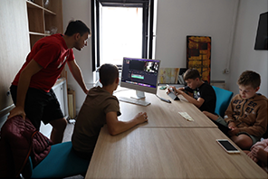  
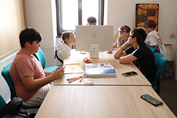 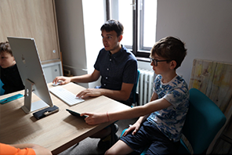 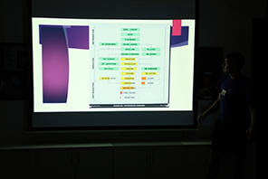
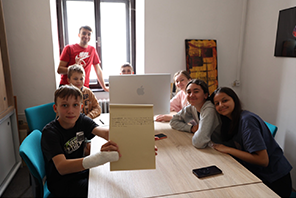 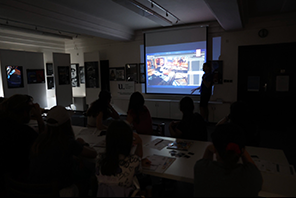 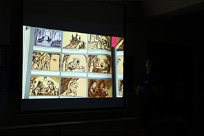
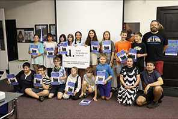

# Background acting in movies:

- [The Performance](https://www.imdb.com/title/tt15300212/) (2021)

- [The Tattooist of Auschwitz](https://www.imdb.com/title/tt9022422/) (2022)

- [Les Loups-Garous](https://www.praguereporter.com/home/2023/7/6/netflix-adaptation-of-werewolf-party-game-starring-jean-reno-now-filming-in-prague/) (2023) (French language)
